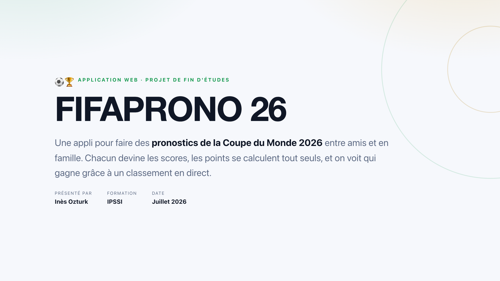
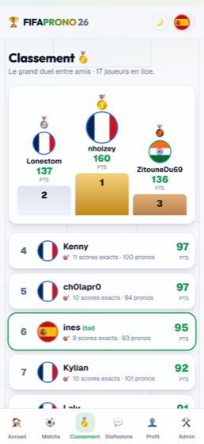
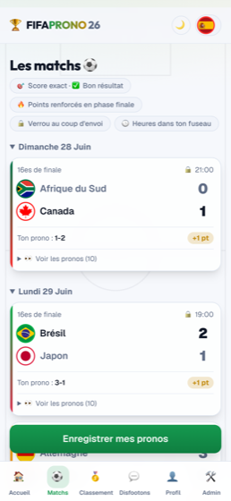
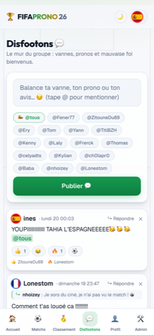
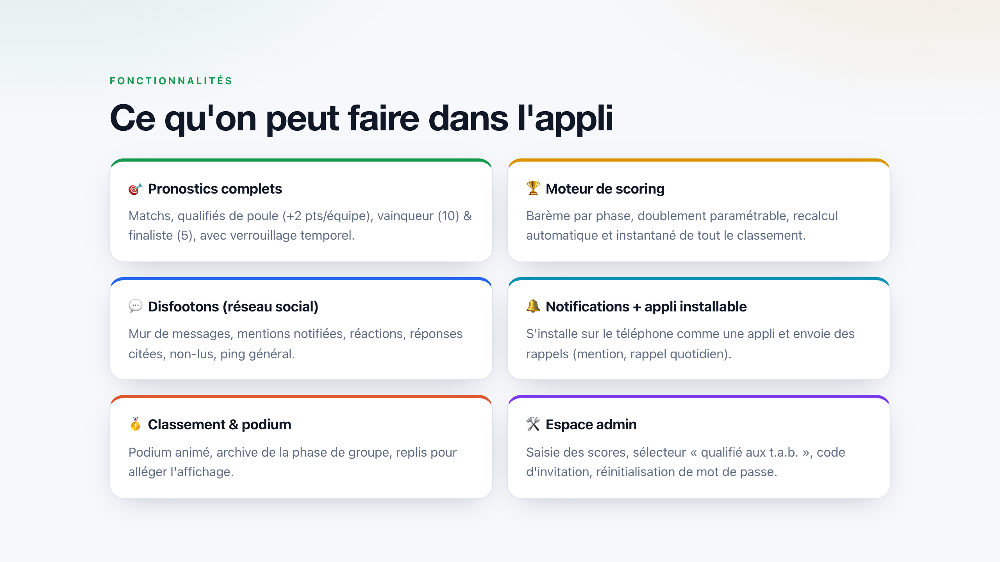
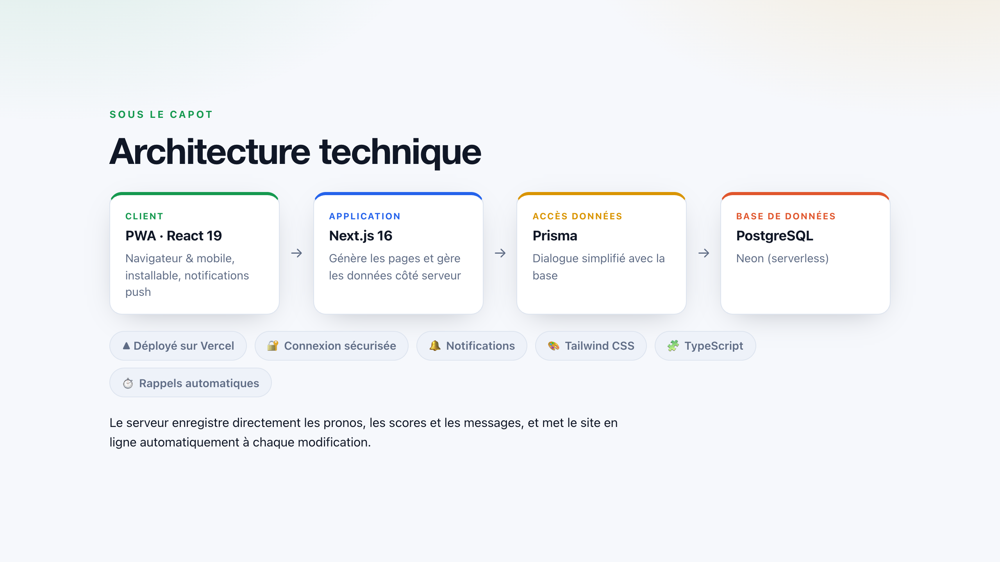
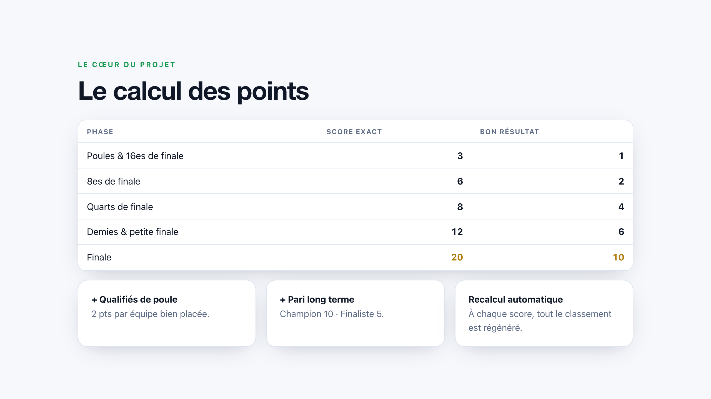
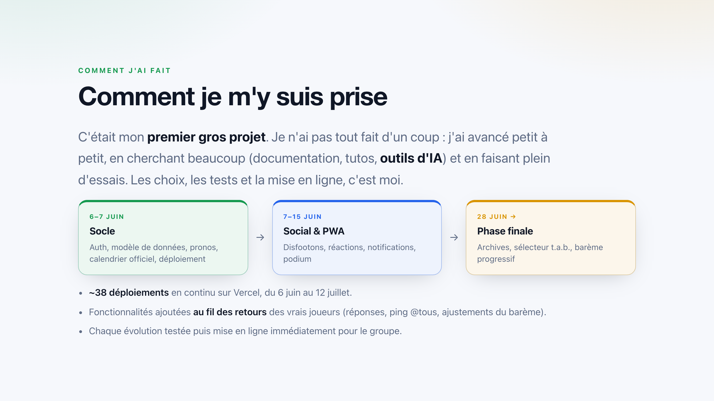

# FIFAPRONO 26 ⚽🏆

Application web de **pronostics de la Coupe du Monde 2026**, à faire entre amis et en famille : chacun devine les scores des matchs, les points se calculent automatiquement, et un classement se met à jour en direct — avec un espace de discussion pour se chambrer.

> Projet de 1re année de Bachelor · IPSSI — Inès Ozturk



## 📱 Aperçu de l'application

<p align="center">
  
  &nbsp;&nbsp;
  
  &nbsp;&nbsp;
  
</p>

<p align="center"><i>🥇 Classement &nbsp;·&nbsp; ⚽ Matchs &amp; pronostics &nbsp;·&nbsp; 💬 Disfootons (le chat)</i></p>

## ✨ Fonctionnalités

- 🎯 **Pronostics** des matchs, des qualifiés de poule et du vainqueur final
- 🏆 **Calcul automatique des points**, avec un barème renforcé en phase finale
- 🥇 **Classement en direct** (podium + rangs)
- 💬 **Chat** entre joueurs (mentions, réactions, réponses)
- 🔔 **Notifications** et **installation sur mobile** (PWA)
- 🛠️ **Espace administrateur** pour saisir les scores et gérer les joueurs



## 🧱 Technologies utilisées

- **Next.js / React** — les pages et l'interface
- **Prisma + PostgreSQL** — la base de données (hébergée sur Neon)
- **Tailwind CSS** — la mise en forme (mode clair / sombre)
- **Vercel** — l'hébergement et la mise en ligne



## 🎯 Le calcul des points

Le cœur du projet : chaque pronostic est comparé au résultat réel, les points sont attribués, puis tout le classement est recalculé automatiquement. Les grands matchs rapportent plus de points.



## 🛠️ La démarche

Construite étape par étape et améliorée au fil des retours des joueurs, l'application a été utilisée pour de vrai pendant tout le tournoi.



## 🚀 Lancer le projet en local

```bash
npm install
npm run dev
```

L'application a besoin de quelques variables d'environnement (base de données, etc.) dans un fichier `.env`, non inclus dans le dépôt pour des raisons de sécurité.

---

Projet réalisé dans le cadre de ma 1re année de Bachelor à l'IPSSI.
